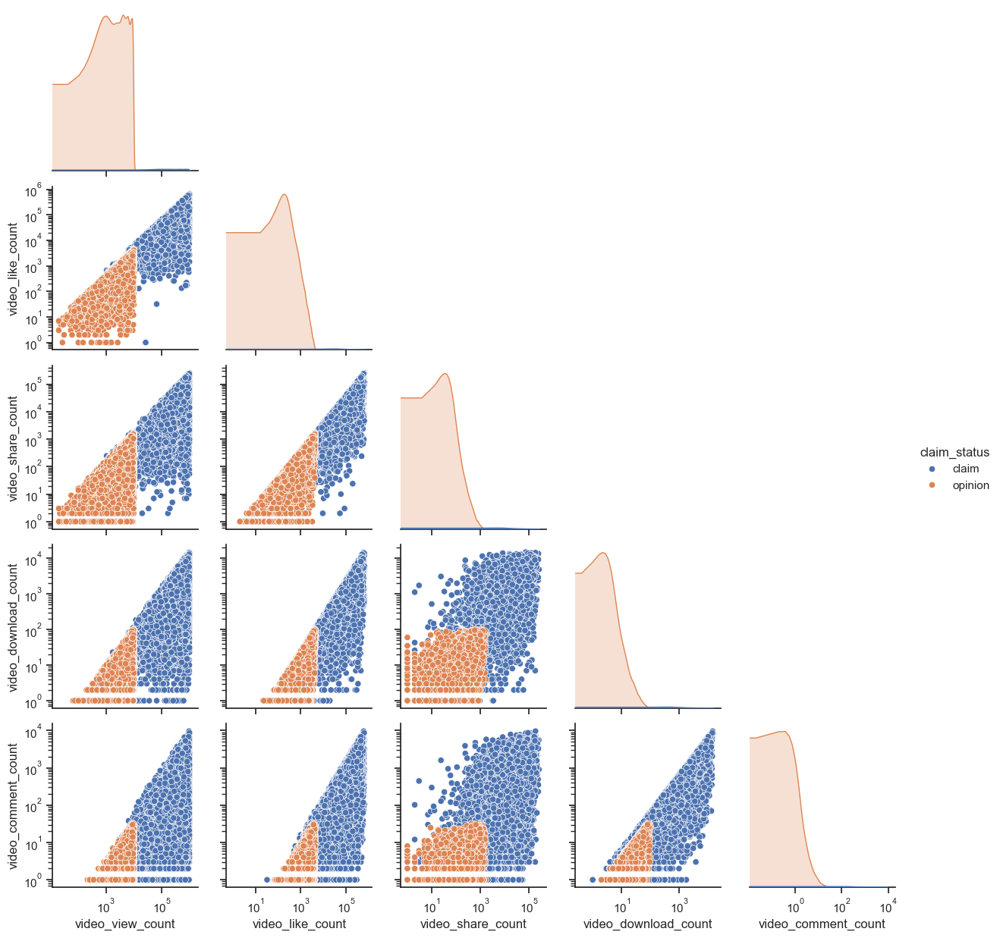

# Tik tok data analysis and content classification
This project provides a concrete example of a typical Machine Learning engineering problem. [The dataset from TikTok](https://www.kaggle.com/datasets/raminhuseyn/dataset-from-tiktok), contains video data, including interaction analysis and transcripts. The objective is to classify each video as either a **claim** or an **opinion**.

Tasks performed in this project include:
1. Exploratory analysis of the dataset, including numerical, categorical, and text attributes.
2. Implementation of a data preprocessing pipeline, incorporating Keras preprocessing layers.
3. Implementation of a neural network to perform the classification
4. Training the model and identifying the optimal set of weights
5. Evaluation of the model
6. Examples of use of the trained model

**Note: yo can execute the code in the file [example.ipynb](example.ipynb).**

## 1. Exploratory data analysis
We start by loading basic libraries, then we read the data set. Note that columns `#` and `vide_id` are eliminated from the analysis, since they do not provide relevant information for the classification.


```python
import numpy as np
import matplotlib.pyplot as plt
import tensorflow as tf
import seaborn as sns
import pandas as pd
from sklearn.model_selection import train_test_split
```


```python
# read dataset
data_path = 'tiktok_dataset.csv'
data = pd.read_csv(data_path)

# drop columns
data = data.drop(['#', 'video_id'], axis=1)

data.head()
```


<div>
<style scoped>
    .dataframe tbody tr th:only-of-type {
        vertical-align: middle;
    }

    .dataframe tbody tr th {
        vertical-align: top;
    }

    .dataframe thead th {
        text-align: right;
    }
</style>
<table border="1" class="dataframe">
  <thead>
    <tr style="text-align: right;">
      <th></th>
      <th>claim_status</th>
      <th>video_duration_sec</th>
      <th>video_transcription_text</th>
      <th>verified_status</th>
      <th>author_ban_status</th>
      <th>video_view_count</th>
      <th>video_like_count</th>
      <th>video_share_count</th>
      <th>video_download_count</th>
      <th>video_comment_count</th>
    </tr>
  </thead>
  <tbody>
    <tr>
      <th>0</th>
      <td>claim</td>
      <td>59</td>
      <td>someone shared with me that drone deliveries a...</td>
      <td>not verified</td>
      <td>under review</td>
      <td>343296</td>
      <td>19425</td>
      <td>241</td>
      <td>1</td>
      <td>0</td>
    </tr>
    <tr>
      <th>1</th>
      <td>claim</td>
      <td>32</td>
      <td>someone shared with me that there are more mic...</td>
      <td>not verified</td>
      <td>active</td>
      <td>140877</td>
      <td>77355</td>
      <td>19034</td>
      <td>1161</td>
      <td>684</td>
    </tr>
    <tr>
      <th>2</th>
      <td>claim</td>
      <td>31</td>
      <td>someone shared with me that american industria...</td>
      <td>not verified</td>
      <td>active</td>
      <td>902185</td>
      <td>97690</td>
      <td>2858</td>
      <td>833</td>
      <td>329</td>
    </tr>
    <tr>
      <th>3</th>
      <td>claim</td>
      <td>25</td>
      <td>someone shared with me that the metro of st. p...</td>
      <td>not verified</td>
      <td>active</td>
      <td>437506</td>
      <td>239954</td>
      <td>34812</td>
      <td>1234</td>
      <td>584</td>
    </tr>
    <tr>
      <th>4</th>
      <td>claim</td>
      <td>19</td>
      <td>someone shared with me that the number of busi...</td>
      <td>not verified</td>
      <td>active</td>
      <td>56167</td>
      <td>34987</td>
      <td>4110</td>
      <td>547</td>
      <td>152</td>
    </tr>
  </tbody>
</table>
</div>


Subsequently, we can observe that there are no null or missing values ​​in the dataset:


```python
data.isnull().sum()
```


    claim_status                0
    video_duration_sec          0
    video_transcription_text    0
    verified_status             0
    author_ban_status           0
    video_view_count            0
    video_like_count            0
    video_share_count           0
    video_download_count        0
    video_comment_count         0
    dtype: int64


First, the following figure shows the distribution of values ​​for the attribute `video_duration_sec`, for the claim and opinion classes. As expected, both classes have a similar distribution, so this attribute does not contain relevant information for classification, so it is eliminated from the data set.


```python
sns.histplot(data, x='video_duration_sec', hue='claim_status', kde=True)
```


    <Axes: xlabel='video_duration_sec', ylabel='Count'>


    

    


```python
# drop column
data = data.drop('video_duration_sec', axis=1)
```

When performing a basic statistical analysis, we realize that the numerical attributes contain values ​​in a wide range, and also have a high standard deviation, which makes the learning process in neural networks difficult. Consequently, it is necessary to perform a normalization process on these attributes.


```python
data.describe()
```


<div>
<style scoped>
    .dataframe tbody tr th:only-of-type {
        vertical-align: middle;
    }

    .dataframe tbody tr th {
        vertical-align: top;
    }

    .dataframe thead th {
        text-align: right;
    }
</style>
<table border="1" class="dataframe">
  <thead>
    <tr style="text-align: right;">
      <th></th>
      <th>video_view_count</th>
      <th>video_like_count</th>
      <th>video_share_count</th>
      <th>video_download_count</th>
      <th>video_comment_count</th>
    </tr>
  </thead>
  <tbody>
    <tr>
      <th>count</th>
      <td>19084.000000</td>
      <td>19084.000000</td>
      <td>19084.000000</td>
      <td>19084.000000</td>
      <td>19084.000000</td>
    </tr>
    <tr>
      <th>mean</th>
      <td>254708.558688</td>
      <td>84304.636030</td>
      <td>16735.248323</td>
      <td>1049.429627</td>
      <td>349.312146</td>
    </tr>
    <tr>
      <th>std</th>
      <td>322893.280814</td>
      <td>133420.546814</td>
      <td>32036.174350</td>
      <td>2004.299894</td>
      <td>799.638865</td>
    </tr>
    <tr>
      <th>min</th>
      <td>20.000000</td>
      <td>0.000000</td>
      <td>0.000000</td>
      <td>0.000000</td>
      <td>0.000000</td>
    </tr>
    <tr>
      <th>25%</th>
      <td>4942.500000</td>
      <td>810.750000</td>
      <td>115.000000</td>
      <td>7.000000</td>
      <td>1.000000</td>
    </tr>
    <tr>
      <th>50%</th>
      <td>9954.500000</td>
      <td>3403.500000</td>
      <td>717.000000</td>
      <td>46.000000</td>
      <td>9.000000</td>
    </tr>
    <tr>
      <th>75%</th>
      <td>504327.000000</td>
      <td>125020.000000</td>
      <td>18222.000000</td>
      <td>1156.250000</td>
      <td>292.000000</td>
    </tr>
    <tr>
      <th>max</th>
      <td>999817.000000</td>
      <td>657830.000000</td>
      <td>256130.000000</td>
      <td>14994.000000</td>
      <td>9599.000000</td>
    </tr>
  </tbody>
</table>
</div>


Finally, the following figure illustrates the relationship between pairs of numerical attributes, where each class is denoted in different colors. Note that **opinion** instances have lower values ​​in all attributes, while **complaint** instances have higher values. This information reveals that numerical (`video_view_count`, `video_like_count`, `video_share_count`, `video_download_count` and `video_comment_count`) attributes contain valuable information for classification. Therefore, in this example they are considered as part of the analysis, in addition to including information from video transcripts (`video_transcription_text`) and author data (`verified_status`, `author_ban_status`).


```python
sns.set_theme(style='ticks')
g = sns.pairplot(data, hue='claim_status', corner=True)

# logaritmic scale
g.set(xscale="log")
g.set(yscale="log")
```


    <seaborn.axisgrid.PairGrid at 0x2478335b460>


    

    


## 2. Data preprocessing pipeline

Regarding the preprocessing pipeline, a function is implemented to transform a Pandas Dataframe into a Tensorflow Dataset, note that this process includes data batching. This function is then applied to data splitting, including training, validation, and test sets.


```python
def df_to_dataset(dataframe, y_label, batch=1):
  dataframe = dataframe.copy()
  
  # extract labels and transform to integers
  labels = dataframe.pop(y_label).values
  _, labels = np.unique(labels,  return_inverse=True)
  
  # Dataset from tensor and labels
  ds = tf.data.Dataset.from_tensor_slices((dict(dataframe), labels)) 
  return ds.batch(batch) # batch

# dat split
train, test = train_test_split(data, test_size=0.2, random_state=1)
train, val = train_test_split(train, test_size=0.2, random_state=1)

# transform Dataframe into Dataset
BATCH_SIZE = 16
train = df_to_dataset(train, y_label='claim_status', batch=BATCH_SIZE)
test = df_to_dataset(test, y_label='claim_status', batch=BATCH_SIZE)
val = df_to_dataset(val, y_label='claim_status', batch=BATCH_SIZE)

print('Number of instances on:')
print(f'- train: {BATCH_SIZE*len(train)}')
print(f'- val: {BATCH_SIZE*len(val)}')
print(f'- test: {BATCH_SIZE*len(test)}')
```

    Number of instances on:
    - train: 12224
    - val: 3056
    - test: 3824


**Note: in this step, the label discretization process transform the clases:**

$$claim\rightarrow 0\quad \text{and}\quad opinion\rightarrow 1$$

A function is implemented to prepare the data preprocessing pipeline, depending on the characteristics of the data. For numeric values, a `Normalization` layer is used to keep the values ​​in a normal distribution. For categorical attributes, a `StringLookup` layer is used, which transforms the input values ​​into a one-hot encoding representation. Finally, for strings, a `TextVectorization` layer is used to transform the input text into a numeric representation, where each integer represents a word in a vocabulary containing the most frequently used words in the dataset.


```python
# input pipeline
def preprocessing_layer(name, dataset, type, max_tokens=10000, output_length=20):
    # extract column name
    feature_ds = dataset.map(lambda x, y: x[name])
    
    # preprocessing options
    if type=='numeric':
        auxIn = tf.keras.Input(shape=(1,), name=name, dtype='int64')
        layer = tf.keras.layers.Normalization(axis=None)
        layer.adapt(feature_ds)
    elif type=='categorical':
        auxIn = tf.keras.Input(shape=(1,), name=name, dtype='string')
        layer = tf.keras.layers.StringLookup(num_oov_indices=0, output_mode='one_hot')
        layer.adapt(feature_ds)
    elif type=='text':
        auxIn = tf.keras.Input(shape=(1,), name=name, dtype='string')
        layer = tf.keras.layers.TextVectorization(max_tokens=max_tokens, output_sequence_length=output_length)
        layer.adapt(feature_ds)
    
    encoded = layer(auxIn)

    # return both, the input and preprocessing layer
    return auxIn, encoded
```

This function is applied to all attributes and is adapted to the information in the training set. Note that all features receive information with an input layer, which is then evaluated with its respective preprocessing layer.Consequently, neural networks can process raw inputs, as the preprocessing process is performed during model evaluation.


```python
inputs = []
encoded_inputs = []

# continuous columns
numerical = ['video_view_count', 'video_like_count', 'video_share_count', 'video_download_count',
             'video_comment_count']
for ni in numerical:
    auxIn, auxEn = preprocessing_layer(name=ni, dataset=train, type='numeric')
    inputs.append(auxIn)
    encoded_inputs.append(auxEn)

# categorical columns
categorical = ['verified_status', 'author_ban_status']
for ci in categorical:
    auxIn, auxEn = preprocessing_layer(name=ci, dataset=train, type='categorical')
    inputs.append(auxIn)
    encoded_inputs.append(auxEn)

# transcription text
textIn, textEn = preprocessing_layer(name='video_transcription_text', dataset=train, type='text')
textEn = tf.cast(textEn, tf.float32) # cast a float 32
inputs.append(textIn)
encoded_inputs.append(textEn)
```

## 3. Implementation of classification model
A neural network is implemented to perform the classification task. Note that the model evaluates its inputs with the preprocessing layer and then the results are evaluated with layers of fully-conected neurons. In this case, the text attribute (`video_transcription_text`) is treated separately from the rest of the features. Then, at the end of the network, all the features are concatenated to perform the classification.


```python
concat_encoded = tf.keras.layers.Concatenate(axis=-1)(encoded_inputs)

# numerical model
nums = concat_encoded[:,:-20]
nd1 = tf.keras.layers.Dense(32, 'relu')(nums)
nd2 = tf.keras.layers.Dense(16, 'relu')(nd1)

# text model
text = concat_encoded[:,-20:]
td1 = tf.keras.layers.Dense(32, 'relu')(text)
td2 = tf.keras.layers.Dense(16, 'relu')(td1)

# concat
full_concat = tf.keras.layers.Concatenate(axis=-1)([nd2, td2])

# classification
out = tf.keras.layers.Dense(units=1, activation='sigmoid')(full_concat)

# model definition
model = tf.keras.Model(inputs, out)

# plor model
tf.keras.utils.plot_model(model, show_shapes=False, rankdir="LR", dpi=300)
```


    

    


## 4. Model training
Regarding the model traning, a custom Callback is implemented, which, during training, identifies the epoch in which the architecture obtains the highest accuracy on the validation set. This callback is then used during training to identify the configuration that performs best with information not included in the training (`val`). In this way, overfitting problems are avoided.


```python
class MaxAccEpoch(tf.keras.callbacks.Callback):
    def __init__(self, epochs):
        super().__init__()
        self.epochs = epochs # number of epochs
        self.val_loss = [] # loss functions data

        self.max_epoch = 0
        self.max_val_acc = 0.0
        self.max_weights = None

    def on_epoch_end(self, epoch, logs=None):
        # when the Callback indentifies a new max val accuracy
        if logs.get('val_acc') > self.max_val_acc:
            self.max_epoch = epoch
            self.max_val_acc = logs.get('val_acc')
            self.max_weights = self.model.get_weights() # copy weights
        self.val_loss.append(logs.get('val_loss'))

        return super().on_epoch_end(epoch, logs)

    def on_train_end(self, logs=None):
        return super().on_train_end(logs)
    
EPOCHS = 20
cb = MaxAccEpoch(EPOCHS) # callback

# model compilation
model.compile(loss=tf.keras.losses.BinaryCrossentropy(),
              optimizer='adam', metrics=['acc'])

# trainin
metrics = model.fit(x=train, validation_data=val, epochs=EPOCHS, callbacks=cb)
```

    Epoch 1/20
    764/764 [==============================] - 11s 11ms/step - loss: 2.3888 - acc: 0.8577 - val_loss: 0.1115 - val_acc: 0.9686
    Epoch 2/20
    764/764 [==============================] - 8s 11ms/step - loss: 0.0904 - acc: 0.9758 - val_loss: 0.0535 - val_acc: 0.9895
    Epoch 3/20
    764/764 [==============================] - 9s 11ms/step - loss: 0.0609 - acc: 0.9838 - val_loss: 0.0445 - val_acc: 0.9902
    Epoch 4/20
    764/764 [==============================] - 9s 11ms/step - loss: 0.0525 - acc: 0.9859 - val_loss: 0.0373 - val_acc: 0.9905
    Epoch 5/20
    764/764 [==============================] - 9s 12ms/step - loss: 0.0482 - acc: 0.9864 - val_loss: 0.0325 - val_acc: 0.9915
    Epoch 6/20
    764/764 [==============================] - 8s 11ms/step - loss: 0.0445 - acc: 0.9878 - val_loss: 0.0302 - val_acc: 0.9921
    Epoch 7/20
    764/764 [==============================] - 8s 10ms/step - loss: 0.0412 - acc: 0.9887 - val_loss: 0.0318 - val_acc: 0.9921
    Epoch 8/20
    764/764 [==============================] - 8s 10ms/step - loss: 0.0402 - acc: 0.9891 - val_loss: 0.0331 - val_acc: 0.9918
    Epoch 9/20
    764/764 [==============================] - 8s 11ms/step - loss: 0.0388 - acc: 0.9893 - val_loss: 0.0378 - val_acc: 0.9925
    Epoch 10/20
    764/764 [==============================] - 8s 11ms/step - loss: 0.0361 - acc: 0.9898 - val_loss: 0.0466 - val_acc: 0.9925
    Epoch 11/20
    764/764 [==============================] - 8s 11ms/step - loss: 0.0346 - acc: 0.9898 - val_loss: 0.0395 - val_acc: 0.9925
    Epoch 12/20
    764/764 [==============================] - 8s 10ms/step - loss: 0.0335 - acc: 0.9901 - val_loss: 0.0433 - val_acc: 0.9921
    Epoch 13/20
    764/764 [==============================] - 8s 11ms/step - loss: 0.0327 - acc: 0.9906 - val_loss: 0.0313 - val_acc: 0.9928
    Epoch 14/20
    764/764 [==============================] - 9s 11ms/step - loss: 0.0312 - acc: 0.9902 - val_loss: 0.0283 - val_acc: 0.9931
    Epoch 15/20
    764/764 [==============================] - 8s 11ms/step - loss: 0.0313 - acc: 0.9903 - val_loss: 0.0285 - val_acc: 0.9928
    Epoch 16/20
    764/764 [==============================] - 8s 11ms/step - loss: 0.0291 - acc: 0.9909 - val_loss: 0.0296 - val_acc: 0.9928
    Epoch 17/20
    764/764 [==============================] - 8s 11ms/step - loss: 0.0288 - acc: 0.9915 - val_loss: 0.0293 - val_acc: 0.9931
    Epoch 18/20
    764/764 [==============================] - 8s 11ms/step - loss: 0.0262 - acc: 0.9918 - val_loss: 0.0359 - val_acc: 0.9925
    Epoch 19/20
    764/764 [==============================] - 8s 11ms/step - loss: 0.0277 - acc: 0.9912 - val_loss: 0.0336 - val_acc: 0.9921
    Epoch 20/20
    764/764 [==============================] - 8s 10ms/step - loss: 0.0251 - acc: 0.9925 - val_loss: 0.0627 - val_acc: 0.9889


Below are the results obtained during the training of the model, including the results on the train and val sets.


```python
fig, axs = plt.subplots(1,2)
fig.set_size_inches((10,4))

labs = ['acc', 'loss']

for i, li in enumerate(labs):
    axs[i].plot(metrics.history[li], label='train')
    axs[i].plot(metrics.history[f'val_{li}'], label='val')

    axs[i].set_title(f'Model {li}')
    axs[i].set_ylabel(li)
    axs[i].set_xlabel('epoch')

handles, labels = axs[-1].get_legend_handles_labels()
fig.legend(handles, labels, bbox_to_anchor=(0.5,-0.15), loc='outside lower center', ncol=2, labelspacing=0., fontsize=14)

plt.show()
```


    

    


Note that the accuracy of the value set starts to decrease in last training epochs, which is attributed to the overfitting problem. For this reason, the callback is used to retrieve the configuration of the model that performed the best.


```python
print(f'Optimal EPOCH: {cb.max_epoch}')
model.set_weights(cb.max_weights)
```

    Optimal EPOCH: 13


## 5. Evaluation of the model
Finally, under the optimal configuration, the model is evaluated. This analysis includes the accuracy, the F1-Score and the confusion matrix obtained with the predictions made under the test set.


```python
from sklearn.metrics import confusion_matrix, ConfusionMatrixDisplay
from sklearn.metrics import f1_score

# accuracy on test set
test_acc = model.evaluate(test)

y_test = []
for _, label in test:
    y_test += list(np.array(label))


preds = model.predict(test)
preds = np.round(preds)
preds = np.reshape(preds, (preds.shape[0],))

# confusion matrix
cm = confusion_matrix(y_test, preds)
disp = ConfusionMatrixDisplay(confusion_matrix=cm)
disp.plot()

# f1 score
f1 = f1_score(y_test, preds)

print(f'Loss on Test set: {test_acc[0]}')
print(f'Accuracy on Test set: {test_acc[1]}')
print(f'F1-Score on test set: {f1}')
```

    239/239 [==============================] - 2s 8ms/step - loss: 0.0529 - acc: 0.9914
    239/239 [==============================] - 1s 5ms/step
    Loss on Test set: 0.05289480462670326
    Accuracy on Test set: 0.9913544654846191
    F1-Score on test set: 0.9912582781456953


    

    


The accuracy metric reveals that the model is able to generalize almost perfectly with new information (`test` set). Furthermore, the confusion matrix shows that there is a low rate of false positives and false negatives, which is reflected in a high F1-score. Therefore, we can conclude that the model is capable of making reliable predictions.

Finally, the obtained model is saved for possible implementation in some application.


```python
model.save('final_model')
```

    INFO:tensorflow:Assets written to: final_model\assets


## 6. Example of use
Finally, a simple example of using the pre-trained model is included. First, the model is loaded with its configuration.


```python
reloaded_model = tf.keras.models.load_model('final_model')
```

Then, given an input instance, the model is used to make predictions. Note the format of the input, which consists of raw data. Since the model includes the preprocessing pipeline, the model is prepared to receive this type of input, making it easy to deploy without the concern of preprocessing the information beforehand.


```python
def predict_with_model(model, inputs, labels, batch=False):
    if batch:
        inputs = {name: tf.convert_to_tensor(value) for name, value in inputs.items()}
    else: # only one instance
        inputs = {name: tf.convert_to_tensor([value]) for name, value in inputs.items()}
    preds = np.array(model.predict(inputs))
    
    # index labels
    inds = np.round(preds)
    outs = [labels[i[0]] for i in inds]
    return outs

# test with raw input
raw_input = {'video_view_count': 20000, 'video_like_count': 200, 'video_share_count':200, 'video_download_count':20,
             'video_comment_count':50, 'verified_status':'not verified', 'author_ban_status':'active',
             'video_transcription_text': "my colleagues' point of view is that 90 percent of goods are shipped by ocean freight"}

# labels names
LABELS = {0:'claim', 1:'opinion'}

# class prediction with pre-trained model
pred = predict_with_model(reloaded_model, raw_input, LABELS)
print(f'Prediction: {pred}')
```

    1/1 [==============================] - 0s 56ms/step
    Prediction: ['opinion']


In addition, the prediction method supports multi-instance inference, as illustrated below:


```python
# raw inputs
raw_input = {'video_view_count': [20000,10000],
             'video_like_count': [200,500],
             'video_share_count':[200,400],
             'video_download_count':[20,30],
             'video_comment_count':[50,1000],
             'verified_status':['not verified', 'not verified'],
             'author_ban_status':['active','active'],
             'video_transcription_text': ["my colleagues' point of view is that 90 percent of goods are shipped by ocean freight",
                                          "a friend learned  from the news that at birth, baby pandas are smaller than mice"]}

labels = {0:'claim', 1:'opinion'}

# class predictions with pre-trained model
preds = predict_with_model(reloaded_model, raw_input, LABELS, batch=True)
print(f'Predictions: {preds}')
```

    1/1 [==============================] - 0s 70ms/step
    Predictions: ['opinion', 'claim']

